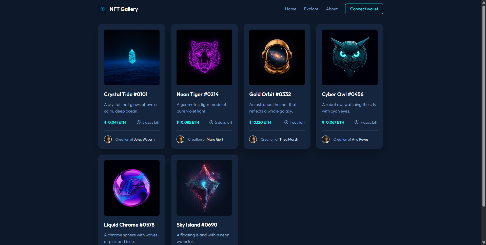

# NFT Gallery

Projeto de front-end com um card de NFT que evoluiu para uma lista de cards com animações e um header responsivo. Feito a partir do desafio **NFT preview card component** do Frontend Mentor.

## Demonstração

🔗 **Site:** https://dorazzii.github.io/nft-card
📁 **Repositório:** https://github.com/dorazzii/nft-card

### Desktop


### Mobile
🎥 [Assistir ao vídeo da versão mobile](screenshots/mobile.mp4)

## Funcionalidades

- Card de NFT fiel ao design do Frontend Mentor
- Efeito de hover no card (overlay com ícone de olho, título em destaque e card que sobe)
- Lista com vários cards gerados a partir de um array em JavaScript
- Animações de entrada dos cards com animate.css
- Header com logo, menu de navegação e botão de destaque
- Menu hambúrguer no mobile
- Layout responsivo (mobile e desktop)

## Tecnologias

- HTML5
- CSS3 (Grid, Flexbox, variáveis CSS, media queries)
- JavaScript
- [animate.css](https://animate.style/)
- [Leonardo.ai](https://leonardo.ai/) (imagens dos cards e logo)
- GitHub e GitHub Pages
- Fonte Outfit (Google Fonts)

## Inspiração

Para o header, usei como referência sites de marketplace de NFT (OpenSea, Rarible e Foundation).

## Como rodar localmente

```bash
git clone https://github.com/dorazzii/nft-card.git
cd nft-card
```

Abra o `index.html` no navegador ou use a extensão Live Server do VS Code.

## Autor

**Henrique Dorazzi dos Reis**
GitHub: [@dorazzii](https://github.com/dorazzii)